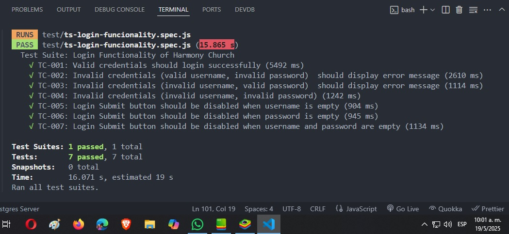
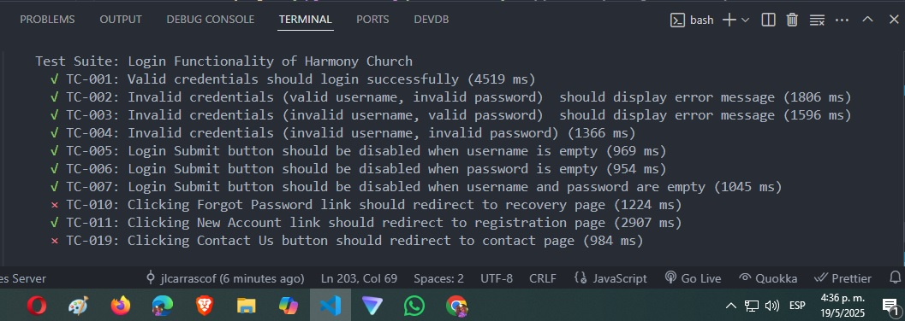

# selenium-jest-suite
Tests using Jest for the suite and Selenium for UI individual tests

19-05-2025: Tests 1-7 are running ....

19-05-2025: Tests 10, 11 and 19 running as we expected ...

---

## 📋 File Responsibilities

### `driverFactory.js`
- Initializes the WebDriver (Chrome).
- Sets global timeouts.
- Contains methods to launch and close the browser instance.

### `pages/LandingPage.js`
- Encapsulates the logic for opening the base URL.
- Provides `clickLoginButton()` using selector `a.px-4`.

### `pages/LoginPage.js`
- `enterUsername()` and `enterPassword()` using placeholder selectors.
- `clickSubmit()` to trigger login.
- `getModalMessageText()` to retrieve login error messages.
- `isSubmitButtonDisabled()` to validate button state.
- `clickLink()` to click dynamic links.
- `canNavigateWithTabsInOrder()` to validate tab order (accessibility).

### `tests/login.spec.js`
- Instantiates the driver via `driverFactory.js`.
- Uses the `LandingPage` and `LoginPage` objects.
- Implements test cases:
  - TC-001 to TC-007
  - TC-010, TC-011
  - TC-012 (tab order)
  - TC-019 (navigation from login)

---

## ✅ 50 Clean Code Principles Applied

### 🔹 Code Structure & Modularity
1. **Single Responsibility Principle (SRP)** in every file/class.
2. **Modular design** via separation between pages, factory, and tests.
3. **Page Object Model** encapsulates UI logic.
4. **Factory Pattern** decouples WebDriver instantiation.
5. **Clear folder structure** to separate concerns.
6. **Reusability**: Page methods reused across multiple test cases.
7. **Encapsulation**: DOM selectors hidden inside page objects.
8. **Avoid magic values**: Selectors and messages centralized.
9. **Helper methods** with clear purposes (e.g., `clickLoginButton()`).
10. **DRY Principle**: No logic duplicated across test cases.

### 🔹 Readability & Naming
11. Descriptive function names (`enterUsername`, `clickSubmit`).
12. Descriptive test names (e.g., `should show error for invalid credentials`).
13. No comments needed: code is self-explanatory.
14. `login.spec.js` describes intent using test names.
15. Readable async/await usage instead of chained promises.
16. Constants and selectors grouped logically.
17. Grouped imports by type (standard, project).
18. Test cases grouped by scenario blocks.
19. Clear variable names (`modalMessage`, `loginButton`).
20. Use of `template literals` where needed.

### 🔹 JavaScript Best Practices
21. Use of `const` and `let` properly (no `var`).
22. Use of ES6 arrow functions where applicable.
23. Minimal side-effects in functions.
24. No nested callbacks; async/await used throughout.
25. Functions are pure where possible.
26. Promotes immutability (avoid mutation).
27. Avoids global state leakage in tests.
28. Uses `beforeAll` and `afterAll` for setup/teardown.
29. Clean console: no `console.log` left in final code.
30. Consistent indentation and formatting.

### 🔹 UI Test Design
31. Every test is **independent** and reproducible.
32. Clear assertions with `expect(...)`.
33. Tests follow **Given-When-Then** structure implicitly.
34. No unnecessary sleeps: explicit waits preferred.
35. No direct DOM manipulation in test files.
36. Accessibility test included (`tab` order validation).
37. Error messages validated via real DOM text.
38. Submit button state dynamically checked.
39. Login flow encapsulated via page methods.
40. Easy-to-read test logic: user-centric behavior.

### 🔹 Scalability & Maintainability
41. Easy to extend with new page objects.
42. Easy to add new test cases without code duplication.
43. WebDriver logic isolated and reusable.
44. Test failure messages are meaningful.
45. Easy to onboard new devs/testers.
46. Works with CI/CD as headless mode is possible.
47. Page methods can be reused in other tests (e.g., dashboard).
48. Consistent structure across all page objects.
49. Code can evolve without affecting test readability.
50. Ideal baseline for team collaboration and test coverage growth.

---

## 🚀 Technologies

- 🧪 [Selenium WebDriver](https://www.selenium.dev/)
- 🧪 [Jest](https://jestjs.io/)
- ⚙️ Node.js
- 🧼 Clean Code
- 📄 Page Object Model
- 🏭 Factory Pattern

---

## 📌 Purpose

This refactored test suite is built to:

- Improve **readability**
- Increase **test reliability**
- Enable **scalability**
- Follow **professional best practices**

---
